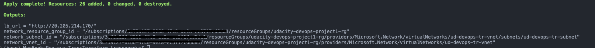

# Azure Infrastructure Operations Project: Deploying a scalable IaaS web server in Azure

### Introduction
Deploying a scalable IaaS web server in Azure using Azure CLi, Packer & Terraform.  
We will use Packer to create a server image, and Terraform to create a template for deploying a scalable cluster of servers—with a load balancer to manage the incoming traffic.  
We’ll also need to adhere to security practices and ensure that our infrastructure is secure.  

### Getting Started
1. Clone this repository
2. Setup Azure Policy
3. Setting Packer
4. Apply Terraform

### Dependencies
1. Create an [Azure Account](https://portal.azure.com) 
2. Install the [Azure command line interface](https://docs.microsoft.com/en-us/cli/azure/install-azure-cli?view=azure-cli-latest)
3. Install [Packer](https://www.packer.io/downloads)
4. Install [Terraform](https://www.terraform.io/downloads.html)

### Instructions

#### Azure Policy

1. Policy Definition

```sh
    az policy definition create --name tagging-policy --rules AzurePolicy/rule.json --param AzurePolicy/parameters.json
```

2. Policy Assignment

```sh
    az policy assignment create --name tagging-policy --policy tagging-policy --param AzurePolicy/assignment.paramerters.json
```

3. Show Policy Definition & Policy Assignment

```sh
    az policy assignment show --name tagging-policy
    az policy definition show --name tagging-policy
```

#### Packer

1. Create resource group contain image.

```sh
    az group create -l southeastasia -n az-devops-udacity-rg-image
```

2. Create Service principal account - checkout subscription

```sh
    az ad sp create-for-rbac --role Contributor --scopes /subscriptions/<Subscription ID> --query "{ client_id: appId, client_secret: password, tenant_id: tenant }"
    az account show --query "{ subscription_id: id }"
```

3. Export eviroment variables using in `Packer/server.json`

```sh
export SUBSCRIPTION_ID="<subscription_id> "
export CLIENT_ID="<client_id belong to rbac>"
export CLIENT_SECRET="<client_secret belong to rbac>"
export TENANT_ID="<tenant_id belong to rbac>"
```

4. Build Packer

```sh
    packer build Packer/server.json
```

#### Terraform
Terraform Folder Structure:  
├── locals.tf       # Network rules  
├── main.tf         # Resource  
└── vars.tf         # Contain input/output variables  

Terraform supports a few different variable formats.  
Depending on the usage, the variables are generally divided into inputs and outputs.  
Some arguments for variable declarations:  
- default
- type
- description
- validateion
- nullable

In this project, variables define in vars.tf. Using variables help to improve code readability, simplifies maintaince and enable scability.

1. Init Terraform

```sh
    cd Terraform
    terraform init
```

2. Validation

```sh
    terraform validate
```

3. Create execute plan file

```sh
    terraform plan -out solution.plan
```

4. Apply Plan

```sh
    terraform apply solution.plan
```


### Output



### Clear Resource

```sh
    terraform plan -destroy -out solution.destroy.plan
    terraform apply solution.destroy.plan
    az image delete --name <server-packer-image> --resource-group <packer resource>
    az group delete -n <packer resource>
    az policy assignment delete --name tagging-policy
    az policy definition delete --name tagging-policy
```